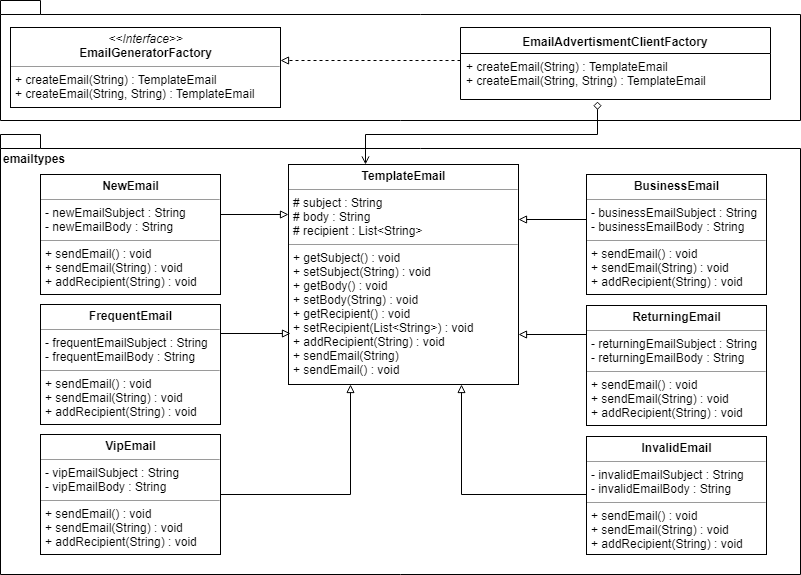

# E-Mail Generator

This is a Java Maven “E-Mail Generation” Application which will auto generate based on specific customer types.

Design pattern used is Factory Method pattern as we want system to generate right email automatically as per customer type instead explicitly calling the methods.

## Generate Java Doc
```
mvn javadoc:javadoc
```

## UML




# Assumptions

Types of Customers : Business, Returning, Frequent, New and VIP

Company/Client Name : Email Advertisement


# Packages

•	cs665 -> "Creator" (wrt factory pattern) or main package

•	emailtypes -> "Products" (wrt factory pattern) or contains classes dedicated to each possible email types


# General Working

Client through Main function calls email factory with recipient types which then creates the class of that specific recipient type.


# Classes/Interfaces

### main package

•	EmailGeneratorFactory : Interface declaring the factory method. It got structure of calling recipient specific email. 

•	EmailAdvertismentClientFactory : Implements and overrides methods of "EmailGeneratorFactory". As per the recipient type received it will create the email type object and send email.

### emailtypes package

•	TemplateEmail : It is an abstract class which will be extended by other types of email classes. It defines a general structure of email which is then modified as per requirement by the classes. Sub classes are changing email subject, body and message to be printed once email delivered.

•	BusinessEmail : For recipient type business.

•	FrequentEmail : For recipient type frequent.

•	NewEmail : For recipient type new.

•	ReturningEmail : For recipient returning.

•	VipEmail : For recipient vip.

•	InvalidEmail : Handles all incorrect invalid requests made.


# Field and Methods

### EmailGeneratorFactory

createEmail(String) : It take type as argument and create the object of that type of email. Client only calls this function with time and all the complexity of object creation and different email is handled without client knowing the implementation.

createEmail(String, String) : Used to add new recipient to list. It take type and recipient name as argument and create the object of that type of email. Client only calls this function all the complexity of object creation and different email format is handled without client knowing the implementation.


### TemplateEmail

subject (String) : Email subject

body (String) : Email body

recipient (List<String>) : Email recipients

**Getters and Setter Methods**

getSubject() 

setSubject(String) 

getBody() 

setBody(String) 

getRecipient()

setRecipient(List<String>) 
  
**Other Methods**

addRecipient(String) : Adds new recipient to the list and sends them mail.

sendEmail(String) : Sends the email to the new recipient added using addRecipient method. If some things are to be done before sending email to recipients, those could be implemented in this method. It provides the flexibility to extend application. It's an overloaded method.

sendEmail() : Sends the email to recipient. If some things are to be done before sending email to recipients, those could be implemented in this method. It provides the flexibility to extend application.

### BusinessEmail, FrequentEmail, NewEmail, ReturningEmail, VipEmail

<?>EmailSubject : Subject value for the recipient type which is over rided or assigned to "subject" inherited. In future if subject content needs to be changed then either a new variable can be created or its value can be updated thus not touching the main code.

<?>EmailBody : Works similar to subject variable. It contains the email body.

sendEmail() : Sends the email to recipient. If some things are to be done before sending email to recipients, those could be implemented in this method. It provides the flexibility to extend application. This is override from parent class.

addRecipient(String)  : Adds new recipient to the mailing list of type.

sendEmail(String)  : Overloaded function, sends email to new recipient.

constructor : It sets subject and body value and sends email.


# How to compile the project

We use Apache Maven to compile and run this project. 

You need to install Apache Maven (https://maven.apache.org/)  on your system. 

Type on the command line: 

```bash
mvn clean compile
```

# How to create a binary runnable package 


```bash
mvn clean compile assembly:single
```


# How to run

```bash
mvn -q clean compile exec:java -Dexec.executable="edu.bu.met.cs665.Main" -Dlog4j.configuration="file:log4j.properties"
```

We recommand the above command for running the project. 

Alternativly, you can run the following command. It will generate a single jar file with all of the dependencies. 

```bash
mvn clean compile assembly:single

java -Dlog4j.configuration=file:log4j.properties -classpath ./target/JavaProjectTemplate-1.0-SNAPSHOT-jar-with-dependencies.jar  edu.bu.met.cs665.Main
```


# Run all the unit test classes.


```bash
mvn clean compile test

```

# Using Findbugs 

To see bug detail using the Findbugs GUI, use the following command "mvn findbugs:gui"

Or you can create a XML report by using  


```bash
mvn findbugs:gui 
```

or 


```bash
mvn findbugs:findbugs
```


For more info about FindBugs see 

http://findbugs.sourceforge.net/

And about Maven Findbug plugin see 
https://gleclaire.github.io/findbugs-maven-plugin/index.html


You can install Findbugs Eclipse Plugin 

http://findbugs.sourceforge.net/manual/eclipse.html


SpotBugs https://spotbugs.github.io/ is the spiritual successor of FindBugs.


# Run Checkstyle 

CheckStyle code styling configuration files are in config/ directory. Maven checkstyle plugin is set to use google code style. 
You can change it to other styles like sun checkstyle. 

To analyze this example using CheckStyle run 

```bash
mvn checkstyle:check
```

This will generate a report in XML format


```bash
target/checkstyle-checker.xml
target/checkstyle-result.xml
```

and the following command will generate a report in HTML format that you can open it using a Web browser. 

```bash
mvn checkstyle:checkstyle
```

```bash
target/site/checkstyle.html
```


# Generate  coveralls:report 

```bash
mvn -DrepoToken=YOUR-REPO-TOCKEN-ON-COVERALLS  cobertura:cobertura coveralls:report
```


